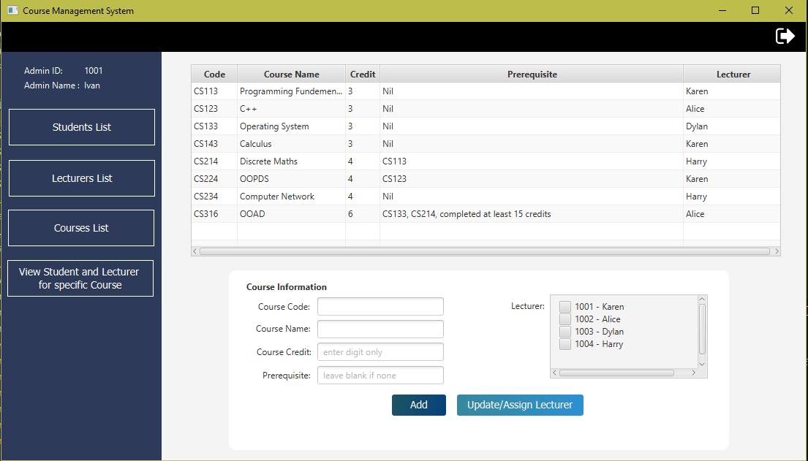
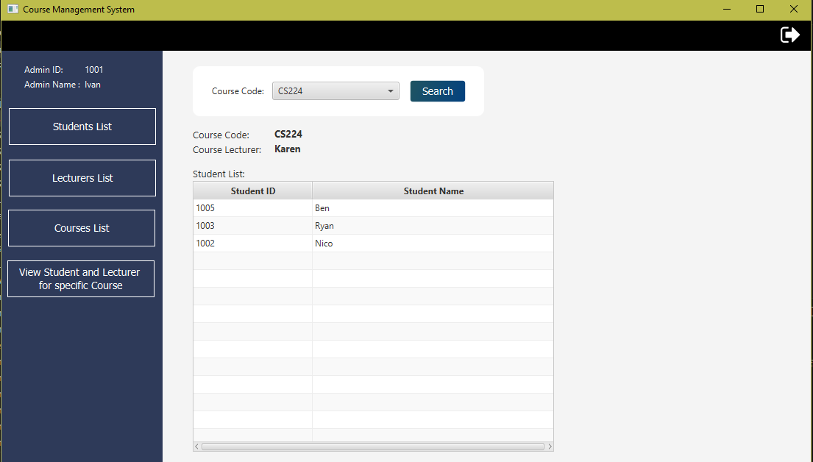
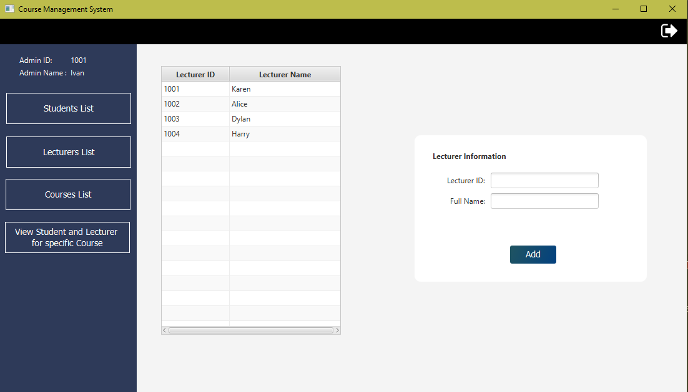
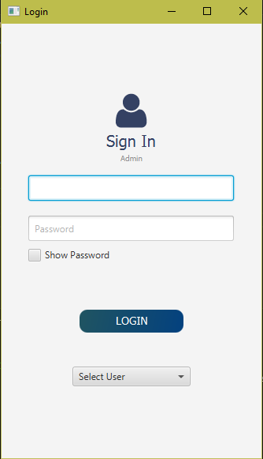
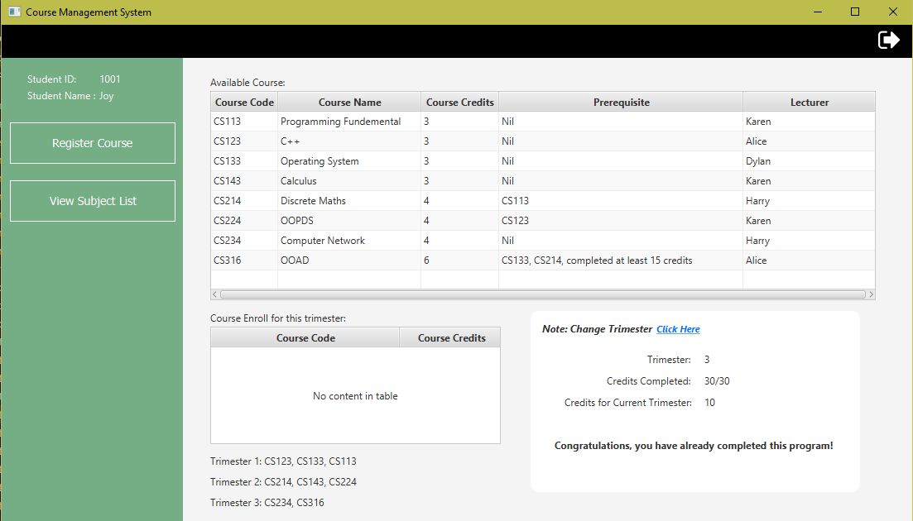
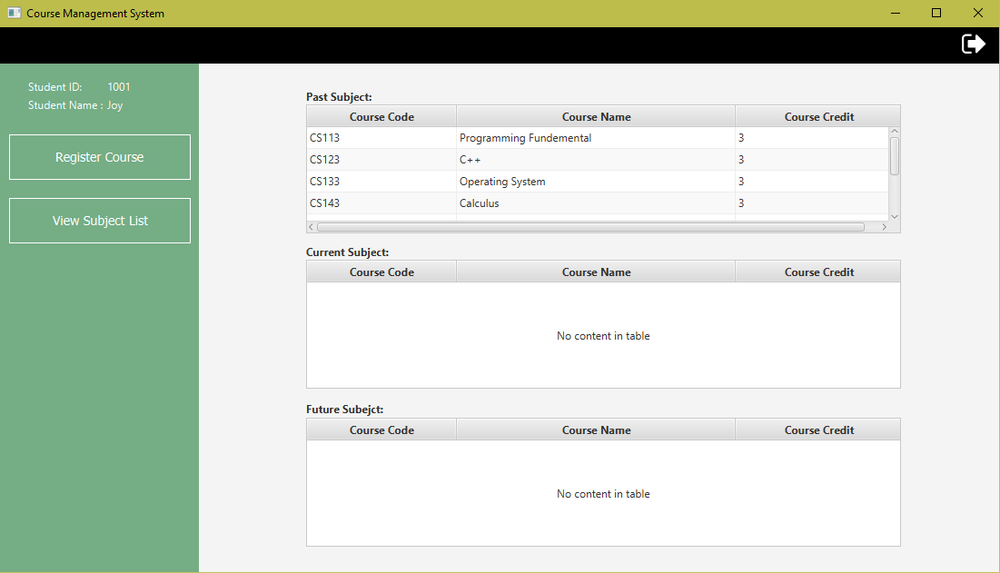

# Trimester Course Registration System

This Trimester Course Registration System is designed to manage student course registrations across trimesters, with specific credit limits, user types, and features for each type of user.

## Features

### User Types
1. **Admin:**
   - Create students and lecturers.
   - Create courses and assign them to lecturers.
   - View all students and lecturers for courses.

2. **Student:**
   - Self-register for courses in new trimesters.
   - View past, current, and future subjects.

3. **Lecturer:**
   - View all students in their courses.

### System Functionality
- Users can log in, and the system recognizes their user type.
- Maximum of 12 credits and minimum of 3 credits per trimester for students.
- Pre-requisite courses for specific courses (e.g. CS214 & CS224, CS316).

### Persistent Storage
- Save student, lecturer, and course data to files.
- Load data from files for continuity.

